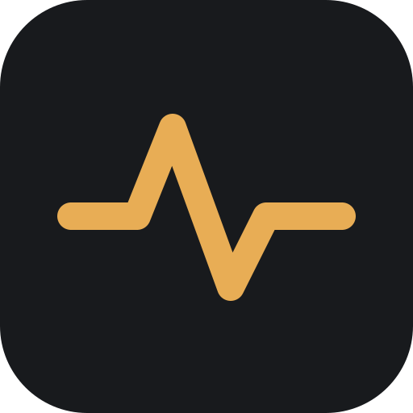
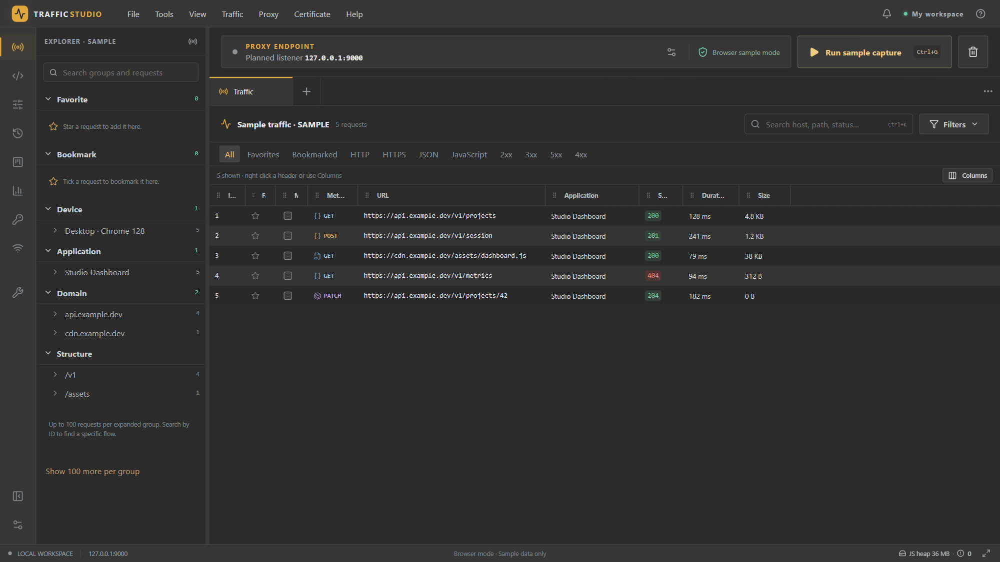
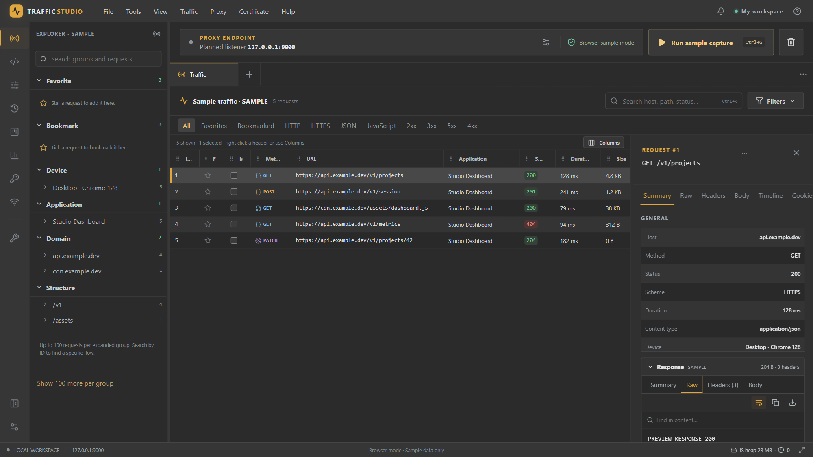

  

# Traffic Studio

Ứng dụng desktop Windows để bắt, phân tích và phát lại lưu lượng HTTP(S) — local-first, không tài khoản, không telemetry.

> **🚧 Coming soon** — dự án đang trong quá trình phát triển, chưa có bản phát hành công khai.

## Demo

Giao diện hiện tại (browser preview với dữ liệu mẫu; capture native đang hoàn thiện — trạng thái chi tiết trong [CHANGELOG.md](CHANGELOG.md)).

## Tính năng chính (mục tiêu)

- **Capture** — proxy cục bộ, nhiều phiên song song; lọc và tìm kiếm theo host, path, method, status, header, body.
- **Inspector** — headers, body, timeline, cookie của từng request; xem khác biệt hai request/session.
- **API client gắn với capture** — sửa và gửi lại request đã bắt; collection, environment, auth, script, history.
- **Tracker** — gán tag, trạng thái, ghi chú cho từng request; table / Kanban / timeline trên cùng một tập dữ liệu.
- **Rules** — rewrite, mock, map local, breakpoint, throttle; bật tắt từng rule.
- **Analytics** — tổng hợp latency, mã trạng thái, lỗi, kích thước payload; drill-down về request gốc.
- **Local-first** — SQLite + FTS cho metadata, payload lưu cục bộ có quota; import/export HAR, secrets không nằm trong export mặc định.

## Trạng thái phát triển

| Hạng mục | Trạng thái |
| --- | --- |
| Stack | Tauri 2 (Rust) + React/TypeScript/Vite, Windows trước |
| UI shell, native HTTP client, storage, rules/protocols | đã có trong source |
| Capture engine, installer, nghiệm thu tương tác native | đang làm |
| Companion Android/iOS | giai đoạn sau |

## Tài liệu

- [CHANGELOG.md](CHANGELOG.md) — lịch sử release và trạng thái xác minh
- [docs/FEATURE_INVENTORY.md](docs/FEATURE_INVENTORY.md) — checklist tính năng
- [docs/DESIGN_SYSTEM.md](docs/DESIGN_SYSTEM.md) — design system
- [docs/PRODUCT_PROPOSAL.md](docs/PRODUCT_PROPOSAL.md) — đề xuất sản phẩm ban đầu (lịch sử planning)
- [docs/STRUCTURE.md](docs/STRUCTURE.md) — cấu trúc mã nguồn

## License

Định hướng open-source; license cụ thể chưa chốt.

*Traffic Studio là dự án độc lập, lấy cảm hứng workflow từ các debugging proxy; không liên kết với và không chứa tài sản hoặc mã nguồn của Reqable.*
